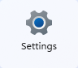
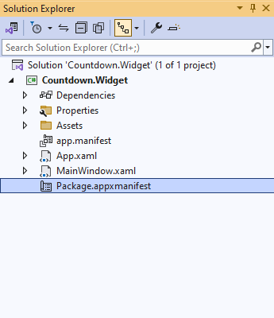

# Windows Widget


## Code

You can **Clone** or **Download** this **Repository** from **GitHub** for the **Code** for the **Workshop**

## Introduction

### About

Welcome to this **Workshop** where you will learn how develop your own **Windows Widget** including how to **Setup & Start** creating your **Widget** and how to **Implement** your **Widget** and how to initialise, deploy and use the **Application** for the **Countdown Widget**. In the **Workshop** you will create a **Countdown Widget** which can be used to **Countdown** to the _Type_ of an **Event** or others such as a _Birthday_, _Celebration_ or _Holiday_ to a _Graduation_ or _Concert_ and will be represented with an **Emoji** on the **Countdown Widget**. There will be a **Timer** using a **Display** with either a _Seven-Segment_ or _Five-by-Seven Matrix_ that features the colour scheme from the **Emoji** selected for the **Countdown Widget**.


You will be able to **Customise** the **Widget** to set the _Type_, _Name_, _Date_ and _Time_ of the **Countdown** and be able to pick the **Display** from _Segment_ or _Matrix_ which you can _Save_ to start or can _Reset_ the **Countdown**.


When the **Countdown Widget** has completed a **Countdown** then a **Toast** notification will be triggered.


### Windows 11


**Windows 11** is the sleek, modern and latest version of **Windows** featuring a centred **Start Menu** with a balanced and organised look-and-feel designed to enable quick and easy access to applications and recent files in a clean layout. **Windows 11** features fresh icons bringing an enhanced visual appeal along with windows that feature rounded corners and can be organised easily with _Snap Layouts_ or arranged with _Snap Groups_. **Windows 11** also supports different desktops to enable personalised workspaces for home, work, play each with their own background to keep things distinct that can be seamlessly switched between to stay focused and manage multiple projects more easily. **Windows 11** is also enhanced features such as _Copilot_ or with _Copilot + PCs_ with _Recall_ powered by _AI_. **Windows 11** also supports **Widgets** such as _Weather_, _Traffic_, _Photos_ and more. Find out more about the latest version of **Windows** at [windows.com](https://windows.com).

### Widgets


**Widgets** in **Windows 11** are small self-contained pieces of dynamic content providing at-a-glance essential information and interactions from the Windows desktop without needing to open a website or app that help keep users informed and up to date all while keeping them in their flow. **Widgets** can be customised to show relevant information or adapt their layout to those set by the user, provide real-time updates ensuring users have the latest information available to them or include interactive elements enabling users to perform actions. **Widgets** can provide current weather and forecasts, latest news headlines and top stories, upcoming events and appointments or enhance productivity with to-do lists or reminders. In the **Widgets Board** you can see **Widgets** and **Add widgets** or **Find more widgets** from the **Microsoft Store**.

### .NET


**.NET** is the free, open-source, cross platform framework from **Microsoft** that provides a wide range of tools and libraries that enables developers to develop powerful cloud services or powers modern applications for mobile, web and desktop. **.NET** is updated each year with enhancements, new features and performance improvements with long-term release even-numbered versions supported for three years and standard-term odd numbered versions supported for eighteen months. **.NET** features extensive libraries created by thousands of developers available on **NuGet** which is the central package repository for **.NET**. Developers using **.NET** can create robust, high-performance applications efficiently from small personal projects to large enterprise applications. Documentation, information and more about **.NET** can be found at [dot.net](https://dot.net).

### C#


**C#** is the powerful open-source cross-platform object-oriented programming language used in **.NET** from **Microsoft**. **C#** is easy to learn and designed for building a wide variety of applications from web, mobile, gaming and desktop offering high performance along with incorporating the best features from other programming languages. **C#** allows developers to create reusable and maintainable code that can be used across a range of industries or applications with features including type safety that ensures types such as _int_ and _string_ are used correctly and can’t be accidentally added together. **C#** also features generics for **Classes**, **Methods** or **Collections** that can work with any **Type** and s_tring_ interpolation which lets you use variables based on types in _strings_. **C#** is updated each year, delivered with **.NET,** allowing it to evolve to meet the needs of developers. Documentation, information, examples and more can be found at [csharp.net](https://csharp.net).

### Windows App SDK


**Windows App SDK** provides a unified set of APIs and tools to develop native applications for **Windows 11** and down-level to _Windows 10 RS5 / 1809_. **Windows App SDK** is independent of **Windows** updates as it is delivered as a **NuGet** package with functionality and feature updates every six months and minor updates on a regular basis. **Windows App SDK** supports modern _WinRT_\-based APIs and native _C_\-based APIs in **Windows** and is installed with the **Workload** for **Windows application development** in **Visual Studio 2022** to create **WinUI 3 in Desktop** applications for **Windows** using **C#**. _XAML_ in **WinUI** can be used to define the visual elements and layout of an application, it separates the user-interface from the business logic of an application. **WinUI** incorporates the _Fluent Design System_ allowing developers to create modern, high-performance applications that are visually appealing and responsive. **Windows App SDK** and **WinUI** functionality is best demonstrated in the **WinUI 3 Gallery** application available from in the **Microsoft Store**. Documentation, information and more on **Windows App SDK** can be found at [aka.ms/winappsdk](https://aka.ms/winappsdk).

### Widget Provider


**Widget Provider** is where developers can deliver a **Widget** in **Windows** using **Windows App SDK** that responds to requests from the **Widgets Board** and returns **JSON** specifying the visual **Template** using **Adaptive Cards** along with **Data** for a **Widget**. Developers can implement a **Widget Provider** using _WinRT_ and _C++_ or with **.NET** and **C#** in **Windows App SDK** using the **Interface** of _IWidgetProvider_ which provides the **Methods** for the required functionality for a **Widget**. This functionality includes when the **Widgets Board** has activated or deactivated a **Widget** or when a **Widget** has been added or removed from the **Widgets Board**. There are **Methods** for when an action occurs, when a **Widget** is resized or when customisation has been requested for a **Widget** which can be done by implementing the **Interface** of _IWidgetProvider2_. Documentation on **Widget Providers** can be found at [aka.ms/widgetdevdocs](https://aka.ms/widgetdevdocs).

### Adaptive Cards


**Adaptive Cards** are platform agnostic UI snippets in **JSON** used by **Widgets** in **Windows 11** to define the visual **Template** for a **Widget,** which are used to exchange at-a-glance content including text, images or provide interactive experiences with actions. **Adaptive Cards** can be written by following the **Schema** or create them using the drag-and-drop **Designer** to arrange elements and structure along with setting any properties of the **Adaptive Card**. Developers or designers can preview **Adaptive Cards** in the **Designer** to see how they would look in the **Widgets Board** host including small, medium and large sizes along with light and dark themes. It is also possible to use _ChatGPT_ or _Microsoft Copilot_ to generate an **Adaptive Card** template with a **Prompt** by asking it to create an **Adaptive Card** for a **Windows 11 Widget** and then describe what it needs to be based on or needs to look like. **Adaptive Cards** can also bind to **Data** which can be updated to enable dynamic content. Documentation, **Schema** and **Designer** along with examples, samples for **Adaptive Cards** and more can be found at [adaptivecards.io](https://adaptivecards.io/).

## Setup

### Developer Mode

**Developer Mode** in **Windows 11** unlocks advanced features for developers and allows you to develop your own applications or even sideload other applications from outside the **Microsoft Store**. You will need to enable **Developer Mode** to create the **Countdown Widget** for this **Workshop** by doing the following:

Select **Start** on the **Taskbar** to launch the **Start Menu**


Then select **Settings** from the **Start Menu**



When in **Settings** select **System**


Next once in **System** select **For developers**


Finally set **Developer Mode** to **On** to enable it

> **Information** - **Developer Mode** will also allow you to develop other applications for **Windows 11** so you can leave it turned **On**, but you can turn **Developer Mode** back **Off** when not developing any **Windows** applications if you want but it will be needed to **Deploy** the **Countdown Widget** for the **Workshop**.

### Visual Studio

**Visual Studio 2022** is used to create a variety of applications on **Windows** including those needed to build a **Windows Widget** and is free or paid **Integrated Development Environment** created by **Microsoft** and you can **Download** if you don’t have it already from [visualstudio.com](https://visualstudio.com).


> **Information** - **Visual Studio 2022** has a free _Community_ edition or paid _Professional_ or _Enterprise_ editions. **Visual Studio 2022** has features to enhance productivity and efficiency of developers including **IntelliSense** which offers code completion and syntax highlighting which adds colours to code making it easier to understand. **Workloads** are available to create such as _ASP.NET and web development_ to create services for the cloud or powerful web applications_, .NET Multi-platform App UI development_ to build cross-platform applications or **Windows application development** to build applications for **Windows** using **Windows App SDK**.

Once **Installer** has **Downloaded**, you can **Run** it to start the **Visual Studio Installer** and select **Continue**.


If you already have **Visual Studio 2022** you can go to **Start** and search for **Visual Studio Installer** to **Modify** your existing **Installation** to make sure you have the necessary **Workload** for **Visual Studio 2022.**

Within the **Visual Studio Installer** whether you are **Installing** or **Modifying** an existing **Installation** of **Visual Studio 2022** from the **Workloads** section of **Desktop & Mobile** you will need to select the **Workload** for **Windows application development** if it has not already been selected or been **Installed**.


> **Information** – The **Workload** for **Windows application development** will allow you to create applications using **Windows App SDK** using **WinUI** which is regularly updates with new features and functionality to enable development of modern applications that take advantage of the latest features in **Windows 11**.

Remember if you have **Visual Studio 2022** already **Installed** it to make sure the **Workload** for **Windows application development** was **Installed** and if so and you have enabled **Developer mode** then you have correctly completed the **Setup** for the **Workshop**.

## Start

### Project

If the **Setup** has been completed including enabling **Developer mode** and have **Installed** both **Visual Studio 2022** and the required **Workload** of **Windows application development**, then you can start **Visual Studio 2022** and create a new **Project** by doing the following:

Select **Start** on the **Taskbar** to launch the **Start Menu**


Then **Search** for **Visual Studio 2022** in the **Start Menu**


Once **Visual Studio 2022** has started from the **Get started** screen for select **Create a new project**


Then select **Blank App, Packaged (Win UI 3 in Desktop)** from the list of **Project Templates** and then select **Next**

> **Information** – It is important to select the correct **Project** type of **Blank App, Packaged (Win UI 3 in Desktop)** as only a **Packaged** applications can support being a **Widget Provider** in **Windows App SDK**.

Once done **Visual Studio 2022** should the display **Configure your new project** as follows:


Then in **Configure your new project** the **Project name** must be entered exactly as follows:

```
Countdown.Widget
```

> **Information** - This will be the name of the **Project**, and it will also control the name used when your application is **Deployed** later in the **Workshop**, so it is important to keep this as _Countdown.Widget_.

Next in **Configure your new project** you need to set the **Location**, but this can be anywhere on your computer e.g. _C:\\Workshop_ and you can keep the **Solution name** the same as the **Project name** as follows:

```
Countdown.Widget
```

The **Place solution and project in the same directory** can be left as-is but if you do change this then this should have no impact on the **Workshop**, it will just put **Solution** and **Project** files together if selected.

Then in **Configure your new project** once the **Project name**, **Location** and **Solution name** have been set you can then select **Create** which will create the new **Solution** and **Project** for _Countdown.Widget_.


> **Information** - Once the **Solution** and **Project** has been created for _Countdown.Widget_ you will see these in the **Solution Explorer**. In the **Project** is the _App.xaml_ which can be expanded to see the _App.xaml.cs_ which is used to initialise the application and there is _Package.appmanifest_ which describes the capabilities of an application and will be updated later in the **Workshop**. Also, within the **Project** is _app.manifest_ which will not be changed in the **Workshop** and _MainWindow.xaml_ which is used for the **Window** of an application but will not be used in the **Workshop**.

Once you have the **Solution** and **Project** for _Countdown.Widget_ then you have correctly created the **Project** for the **Workshop** and can start adding the necessary **Packages**.

### Packages

With the **Solution** and **Project** created in **Visual Studio 2022** you will add **Packages** that will be used for _Countdown.Widget_ by selecting **View**, then **Other Windows** and select **Package Manager Console** from the **Menu** in **Visual Studio 2022** as follows:


Then in **Package Manager Console** you will add the **Packages** that will be used in the **Project** for _Countdown.Widget_, to add the first **Package** of _Comentsys.Toolkit_, type the following and then press **Enter**:

```
Install-Package Comentsys.Toolkit
```

> **Information** - This will add the **Package** from **NuGet** for _Comentsys.Toolkit_ created by _Peter Bull_ to the **Project** which will provide functionality for the **Assets** that will be used by _Countdown.Widget_.

While still in the **Package Manager Console** you will add the second **Package** to be used of _Comentsys.Toolkit.WindowsAppSdk_ by typing the following and press **Enter**:

```
Install-Package Comentsys.Toolkit.WindowsAppSdk
```

> **Information** - This will add the **Package** from **NuGet** for _Comentsys.Toolkit.WindowsAppSdk_ created by _Peter Bull_ to the **Project** which will provide the **Widget Provider** that implements the required **Methods**, help **Register** the **Widget** and **BaseWidget** to make it easy to implement the functionality of the **Countdown Widget**.

Then while still in the **Package Manager Console** you will add the third **Package** to be used of _Comentsys.Assets.FluentEmoji_ by typing the following and press **Enter**:

```
Install-Package Comentsys.Assets.FluentEmoji
```

> **Information** - This will add the **Package** from **NuGet** for _Comentsys.Assets.FluentEmoji_ created by _Peter Bull_ to the **Project** that contains **Assets** for the open-source **Fluent Emoji** created by **Microsoft** in a _Flat_ style to be used in the **Countdown Widget**.

Finally while still in the **Package Manager Console** you will add the final **Package** to be used of _Comentsys.Assets.Display_ by typing the following and press **Enter**:

```
Install-Package Comentsys.Assets.Display
```

> **Information** - This will add the **Package** from **NuGet** for _Comentsys.Assets.Display_ created by _Peter Bull_ to the **Project** that provides **Assets** for a **Display** in a **Seven**\-**Segment** or **Five-by-Seven Dot-Matrix** style that will be used in the **Countdown Widget**.

You can now **Close** the **Package Manager Console** as it is no longer needed as you have added all the **Packages** needed in the **Project** of _Countdown.Widget_ for the **Workshop**.

### Manifest

With all four of **Packages** added to the **Project** for _Countdown.Widget_ you will need to make changes to the **Manifest** in the _Package.appxmanifest_ to correctly register your application as a **Widget Provider**. To do this **Double-Click** on _Package.appxmanifest_ in **Solution Explorer** in **Visual Studio 2022**.



You should then see the **Designer** for the _Package.appxmanifest_, then to view the **Code** for the _Package.appxmanifest_ in **Visual Studio 2022** from the **Menu** select **View** then **Code**.


**Visual Studio 2022** should then display the **Code** with the **XML** for the _Package.appxmanifest_ as follows:


hile in the **Code** for the _Package.appxmanifest_ in the **Section** for **Package** at the top and above the line **IgnorableNamespaces="uap rescap"** type or _Copy_ and _Paste_ the following:

```xml
xmlns:uap3="http://schemas.microsoft.com/appx/manifest/uap/windows10/3"
xmlns:com="http://schemas.microsoft.com/appx/manifest/com/windows10"
```

> **Information** - This will add the necessary **Namespaces** that will be used in the **XML** for the _Package.appxmanifest_

Then still in the **Section** for **Package** you will need to update **IgnorableNamespaces** to add to **uap rescap** by typing including a **Space** at the start the following:

```xml
uap3
```

The **Value** for **IgnorableNamespaces** within the **Section** for **Package** should now appear as follows:

```xml
IgnorableNamespaces="uap rescap uap3"
```

If these have been done correctly then the **Section** for **Package** in the **XML** should appear as follows:

```xml

```xml
<Package
  xmlns="http://schemas.microsoft.com/appx/manifest/foundation/windows10"
  xmlns:mp="http://schemas.microsoft.com/appx/2014/phone/manifest"
  xmlns:uap="http://schemas.microsoft.com/appx/manifest/uap/windows10"
  xmlns:rescap="http://schemas.microsoft.com/appx/manifest/foundation/windows10/restrictedcapabilities"
  xmlns:uap3="http://schemas.microsoft.com/appx/manifest/uap/windows10/3"
  xmlns:com="http://schemas.microsoft.com/appx/manifest/com/windows10"
  IgnorableNamespaces="uap rescap uap3">
```

Then while still in the **Code** for the _Package.appxmanifest_ in the **Section** of **Identity** you will need to _Copy_ and _Paste_ this **Value** into **Notepad** which is a **GUID** used to identify the application e.g. _f2986b9a-a918-4ecd-b03f-5b9f9ce03ea8_ to be used in another **Section** of _Package.appxmanifest_ and later in **Workshop**.

While still in the **Code** for the _Package.appxmanifest_ in the **Section** of **uap:VisualElements** you will need to add an **Element** above **DisplayName="Countdown Widget"** by typing or _Copy_ and _Paste_ the following:

```xml
AppListEntry="none"
```

The start of the **Section** for **uap:VisualElements** should be like the following:

```xml
<uap:VisualElements
  AppListEntry="none" 
  DisplayName="Countdown Widget"
  ...
</uap:VisualElements>
```

Next while still in the **Code** for the _Package.appxmanifest_ in the **Section** for **Applications** after the end of **</uap:VisualElements>** you need to _Copy_ and _Paste_ the following **XML**:

```xml
<Extensions>
    <com:Extension Category="windows.comServer">
        <com:ComServer>
            <com:ExeServer Executable="Countdown.Widget.exe" 
                DisplayName="Countdown Widget">
                <com:Class Id="GUID" DisplayName="Countdown Widget" />
            </com:ExeServer>
        </com:ComServer>
    </com:Extension>
    <uap3:Extension Category="windows.appExtension">
        <uap3:AppExtension Name="com.microsoft.windows.widgets" 
            DisplayName="Countdown Widget" 
            Id="CountdownWidget" 
            PublicFolder="Public">
            <uap3:Properties>
                <WidgetProvider>
                    <ProviderIcons>
                        <Icon Path="Assets\StoreLogo.png" />
                    </ProviderIcons>
                    <Activation>
                        <CreateInstance ClassId="GUID" />
                    </Activation>
                    <Definitions>
                        <Definition Id="CountdownWidget"
                            DisplayName="Countdown Widget"
                            Description="Countdown Widget"
                            IsCustomizable="true">
                            <Capabilities>
                                <Capability>
                                    <Size Name="medium" />
                                </Capability>
                            </Capabilities>
                            <ThemeResources>
                                <Icons>
<Icon Path="Assets\LockScreenLogo.scale-200.png" />
                                </Icons>
                                <Screenshots>
<Screenshot Path="Assets\Square150x150Logo.scale-200.png" />
                                </Screenshots>
                                <DarkMode />
                                <LightMode />
                            </ThemeResources>
                        </Definition>
                    </Definitions>
                </WidgetProvider>
            </uap3:Properties>
        </uap3:AppExtension>
    </uap3:Extension>
</Extensions>
```

> **Information** – This will add a **Section** of **Extensions** to helper **Register** the **Countdown Widget** that will be implemented later in the **Workshop**.

Finally, while still in the **Code** for the _Package.appxmanifest_ in the **Section** of **Extensions** that was added update the **Value** of **Id** for the **Element** of **com:Class** and the **Value** of **ClassId** in the **Element** of **CreateInstance** to be the **GUID** from your notes or **Notepad** e.g. _f2986b9a-a918-4ecd-b03f-5b9f9ce03ea8_ but remember to use your own **GUID**, and remember to keep this for later in the **Workshop**.

The **Value** of **Id** for the **Element** of **com:Class** should be like the following example but should use the **GUID** from your own application:

```xml
<com:Class Id="bf6fc082-dad6-476d-add7-7f3843c78cc3" DisplayName="Countdown Widget" />
```

The **Value** of **ClassId** for the **Element** of **CreateInstance** should be like the following example but should also use the **GUID** from your own application:

```xml
<CreateInstance ClassId="bf6fc082-dad6-476d-add7-7f3843c78cc3" />
```

> **Information** – The **com:ComServer** and **com:ExeServer** elements in the **Section** for **Extensions** will register the application to be invoked by **Windows 11** and the **uap3:AppExtension** elements will register the **Widget** with the **Widgets Board** which includes the **DisplayName** and **Description** for the **Widget** along with the **Icon** and a **Screenshot** images to be used when the **Widget** is being added to the **Widgets Board**. The **Countdown Widget** is customisable set with **IsCustomizable** and is set to be a **medium** sized **Widget**.

You can now **Close** the **Code** for _Package.appxmanifest_ as you have completed the changes needed for the **Workshop**, which was adding the **Namespaces** and updating the **IgnorableNamespaces**, adding the **Element** for **AppListEntry** and **Section** of **Extensions** and updated it for the **GUID**.

If the changes to the **Code** for _Package.appxmanifest_ have been done after having installed the **Packages** after creating the **Project** after having installed both **Visual Studio 2022** and the **Workload** then you have finished the **Setup** of the **Workshop**, otherwise check over everything and you are ready for the **Implementation** part of the **Workshop**!

## Implementation

### Assets

If you have completed **Setup** already but don’t have **Visual Studio 2022** with the **Solution** for _Countdown.Widget_ open then start **Visual Studio 2022** and select the **Solution** for _Countdown.Widget_ that should be in the **Recent** list, if you have not completed **Setup** then make sure to complete this including creating the **Project**, installing the **Packages** and updating the **Manifest** of _Package.appxmanifest_ to correctly register your application as a **Widget Provider**.

You will need to add some **Assets** to your application for **Configure** and **Template** using **Adaptive Cards** so within **Visual Studio 2022** open the **Folder** for **Assets** in the **Project** which will reveal all existing **Assets**.


> **Information** – Some of the **Assets** have already been used in the _Package.appxmanifest_ during **Setup** to provide the **Screenshot** and **Icon** used when adding the **Widget** in the **Widgets Board** which you will see later in the **Workshop**.

#### Configure

While in **Solution Explorer** you need to **Right-Click** on the **Folder** for **Assets** and choose **Add** then **New Item…** and then from **C# Items** choose **Web** and select **JavaScript JSON Configuration File** as follows:


Then type in the **Name** for **Add New Item** as follows and then select **Add**:

```
Configure.json
```

Once _Configure.json_ has been added return to **Solution Explorer** and **Right-Click** on _Configure.json_ in **Assets** and choose **Properties** and then in the **Properties** set the **Build Action** to **Content** as follows:


Then in **Visual Studio 2022** within _Configure.json_, if not selected then **Double-Click** on _Configure.json_ in **Solution Explorer** and then replace the contents of the file by typing or _Copy_ and _Paste_ the following:

```json
{
  "$schema": "http://adaptivecards.io/schemas/adaptive-card.json",
  "type": "AdaptiveCard",
  "version": "1.6",
  "body": [
    {
      "type": "Input.ChoiceSet",
      "id": "TimerType",
      "value": "${TimerType}",
      "choices": [
        {
          "title": "Party 🎉",
          "value": "PartyPopper"
        },
        {
          "title": "Celebration 🎀",
          "value": "Ribbon"
        },
        {
          "title": "Birthday 🎂",
          "value": "BirthdayCake"
        },
        {
          "title": "Holiday ✈️",
          "value": "Airplane"
        },
        {
          "title": "Graduation 🎓",
          "value": "GraduationCap"
        },
        {
          "title": "Concert 🎤",
          "value": "Microphone"
        },
        {
          "title": "Event 🎫",
          "value": "Ticket"
        },
        {
          "title": "General ⏲️",
          "value": "TimerClock"
        }
      ]
    },
    {
      "id": "Countdown",
      "type": "Input.Text",
      "placeholder": "Countdown Name",
      "value": "${Countdown}"
    },
    {
      "type": "Input.Date",
      "id": "TimerDate",
      "title": "Event Date",
      "value": "${TimerDate}"
    },
    {
      "type": "Input.Time",
      "id": "TimerTime",
      "title": "Event Time",
      "value": "${TimerTime}"
    },
    {
      "type": "Input.ChoiceSet",
      "id": "DisplayType",
      "value": "${DisplayType}",
      "style": "compact",
      "choices": [
        {
          "title": "Segment",
          "value": "Segment"
        },
        {
          "title": "Matrix",
          "value": "Matrix"
        }
      ]
    },
    {
      "type": "ActionSet",
      "actions": [
        {
          "type": "Action.Execute",
          "title": "Save",
          "verb": "save"
        },
        {
          "type": "Action.Execute",
          "title": "Reset",
          "verb": "reset"
        },
        {
          "type": "Action.Execute",
          "title": "Close",
          "verb": "close"
        }
      ]
    },
    {
      "type": "TextBlock",
      "text": "${Error}",
      "color": "Attention",
      "horizontalAlignment": "Center"
    }
  ]
}
```

> **Information** – The  **JSON** for _Configure.json_ defined part of the **Adaptive Card** to **Configure** the **Countdown Widget** including the **Type** of **Countdown** for the **Countdown Widget** which will be represented by an **Emoji** in the **Template** then there are **Inputs** for the **Name** of the **Countdown** along with the **Date** and the second **JSON** fragment defined the **Time** for the **Countdown** to complete and an option to choose the **Display** for the **Countdown** from **Segment** or **Matrix**. Then the **JSON** completes the **Adaptive Card** with **Actions** that can be executed including **Save**, **Reset** and **Close** along with a **Message** that can be output in the event of an **Error**.

#### Template

While in **Solution Explorer** you need to **Right-Click** on the **Folder** for **Assets** and choose **Add** then **New Item…** and then from **C# Items** choose **Web** and select **JavaScript JSON Configuration File** as follows:


Then type in the **Name** for **Add New Item** as follows and then select **Add**:

```
Template.json
```

Once _Template.json_ has been added return to **Solution Explorer** and **Right-Click** on _Template.json_ in **Assets** and choose **Properties** and then in the **Properties** set the **Build Action** to **Content** as follows:


Then in **Visual Studio 2022** within _Template.json_, if not selected then **Double-Click** on _Template.json_ in **Solution Explorer** and then replace the contents of the file by typing or _Copy_ and _Paste_ the following:

```json
{
  "$schema": "http://adaptivecards.io/schemas/adaptive-card.json",
  "type": "AdaptiveCard",
  "version": "1.6",
  "body": [
    {
      "type": "Image",
      "size": "Large",
      "horizontalAlignment": "Center",
      "url": "data:image/svg+xml;base64,${ImageData}"
    },
    {
      "type": "TextBlock",
      "text": "${Countdown}",
      "horizontalAlignment": "Center",
      "style": "heading"
    },
    {
      "type": "ColumnSet",
      "columns": [
        {
          "type": "Column",
          "spacing": "ExtraLarge",
          "items": [
            {
              "type": "ColumnSet",
              "columns": [
                {
                  "type": "Column",
                  "items": [
                    {
                      "type": "Image",
                      "url": "data:image/svg+xml;base64,${DaysTens}"
                    }
                  ]
                },
                {
                  "type": "Column",
                  "items": [
                    {
                      "type": "Image",
                      "url": "data:image/svg+xml;base64,${DaysUnits}"
                    }
                  ]
                }
              ]
            },
            {
              "type": "TextBlock",
              "text": "Days",
              "horizontalAlignment": "Center",
              "weight": "Bolder"
            }
          ]
        },
        {
          "type": "Column",
          "spacing": "ExtraLarge",
          "items": [
            {
              "type": "ColumnSet",
              "columns": [
                {
                  "type": "Column",
                  "items": [
                    {
                      "type": "Image",
                      "url": "data:image/svg+xml;base64,${HoursTens}"
                    }
                  ]
                },
                {
                  "type": "Column",
                  "items": [
                    {
                      "type": "Image",
                      "url": "data:image/svg+xml;base64,${HoursUnits}"
                    }
                  ]
                }
              ]
            },
            {
              "type": "TextBlock",
              "text": "Hours",
              "horizontalAlignment": "Center",
              "weight": "Bolder"
            }
          ]
        },
        {
          "type": "Column",
          "spacing": "ExtraLarge",
          "items": [
            {
              "type": "ColumnSet",
              "columns": [
                {
                  "type": "Column",
                  "items": [
                    {
                      "type": "Image",
                      "url": "data:image/svg+xml;base64,${MinutesTens}"
                    }
                  ]
                },
                {
                  "type": "Column",
                  "items": [
                    {
                      "type": "Image",
                      "url": "data:image/svg+xml;base64,${MinutesUnits}"
                    }
                  ]
                }
              ]
            },
            {
              "type": "TextBlock",
              "text": "Minutes",
              "horizontalAlignment": "Center",
              "weight": "Bolder"
            }
          ]
        }
      ]
    }
  ]
}
```

> **Information** – This **JSON** contains the **Adaptive Card** to represent the **Template** including the **Emoji** to display for the **Countdown Widget** as a **Base-64** encoded **SVG** and for the **Name** of the **Countdown**, the layout for **Days** with **Tens**, **Units** and **Label** and the **Hours** the **Tens** for the **Timer** displayed the **Countdown Widget** and completes **Hours** with the **Units** and **Label** and the layout for **Minutes** for **Timer** on the **Countdown Widget** including **Tens** and **Units** for the **Timer** on the **Countdown Widget**.

This completes the **Adaptive Card** for the **Template** of the **Countdown Widget**, and you can go back through each **JSON** file to make sure they are correct. However, if you have any issues typing or _Copying_ or _Pasting_ the **Adaptive Card** for **Configure** or **Template** you can **Download** the **Files** for [Configure.json](./Files/Configure.json) and [Template.json](./Files/Template.json).

This completes the **Adaptive Card** for the **Template** of the **Countdown Widget**, the next section of the **Workshop** will be to implement the **Classes** needed for the **Countdown Widget**.

### Classes

#### Types

While in the **Project** in **Visual Studio 2022** for _Countdown.Widget_, in **Solution Explorer** you need to **Right-Click** on the **Project** and choose **Add** then **New Item…**


Then in **Add New Item** from **C# Items** choose **Code** and select **Code File** as follows:


Then type in the **Name** for **Add New Item** as follows and then select **Add**:

```
DisplayType.cs
```

You will be in the **View** for the **Code** of _DisplayType.cs_ where you need to type or _Copy_ and _Paste_ following **Code**:

```csharp
namespace Countdown.Widget;

public enum DisplayType
{
    Segment,
    Matrix
}
```

> **Information** – This defines an **enum** that is used for values for the **Display** types of _Segment_ and _Matrix_.

Then in **Solution Explorer** you need to **Right-Click** on the **Project** and choose **Add** then **New Item…** then in **Add New Item** from **C# Items** choose **Code** and select **Code File** as follows:


Then type in the **Name** for **Add New Item** as follows and then select **Add**:

```
ConfigureData.cs
```

You will now be in the **View** for the **Code** of _ConfigureData.cs_ where you need to type or _Copy_ and _Paste_ the following **Code**:

```csharp
using Comentsys.Assets.FluentEmoji;

namespace Countdown.Widget;

public class ConfigureData
{
    public string Error { get; set; }

    public bool Active { get; set; }

    public string Countdown { get; set; }

    public FluentEmojiType TimerType { get; set; }

    public string TimerDate { get; set; }

    public string TimerTime { get; set; } 

    public DisplayType DisplayType { get; set; }
}
```

> **Information** – This defines a **class** of **ConfigureData** will be used to **Configure** the **Widget** this includes **Error** which will be used if the **Countdown** isn’t set correctly, then there is a value to indicate that the **Countdown** is **Active**. Then there is a value to output the **Name** of the **Countdown** with **Countdown** and then there is **TimerType** which represents the **Emoji** used for the **Countdown** along with the **TimerDate** and **TimerTime** for when the **Countdown** is for and the **DisplayType**.

Then in **Solution Explorer** you need to **Right-Click** on the **Project** and choose **Add** then **New Item…** then in **Add New Item** from **C# Items** choose **Code** and select **Code File** as follows:


Then type in the **Name** for **Add New Item** as follows and then select **Add**:

```
TemplateData.cs
```

You will now be in the **View** for the **Code** of _TemplateData.cs_ where you need to type or _Copy_ and _Paste_ the following **Code**:

```csharp
namespace Countdown.Widget;

public class TemplateData
{
    public string Countdown { get; set; }

    public string ImageData { get; set; }

    public string DaysTens { get; set; }

    public string DaysUnits { get; set; }

    public string HoursTens { get; set; }

    public string HoursUnits { get; set; }

    public string MinutesTens { get; set; }

    public string MinutesUnits { get; set; }
}
```

> **Information** – This defines a **class** of **TemplateData** will be used in the **Template** for the **Widget** this includes a value to output the **Name** of the **Countdown** with **Countdown** and **ImageData** for the **Emoji** then there are values for the **Tens** and **Units** for **Days**, **Hours** and **Minutes** which will be used to **Display** the **Countdown**.

Then in **Solution Explorer** you need to **Right-Click** on the **Project** and choose **Add** then **New Item…** then in **Add New Item** from **C# Items** choose **Code** and select **Code File** as follows:


Then type in the **Name** for **Add New Item** as follows and then select **Add**:

```
WidgetProvider.cs
```

You will now be in the **View** for the **Code** of _WidgetProvider.cs_, type or _Copy_ and _Paste_ the following **Code**:

```csharp
using Comentsys.Toolkit.WindowsAppSdk;
using System;
using System.Runtime.InteropServices;

namespace Countdown.Widget;

[Guid("GUID")]
internal class WidgetProvider : WidgetProviderBase;
```

Finally, while still in the **Code** for the _WidgetProvider.cs_ replace the contents of the **Attribute** for **Guid** with your own **GUID** from your notes or **Notepad** e.g. _f2986b9a-a918-4ecd-b03f-5b9f9ce03ea8_

```csharp
[Guid("f2986b9a-a918-4ecd-b03f-5b9f9ce03ea8")]
```

Continue to **Helper** once **DisplayType**, **ConfigureData**, **TemplateData** and **WidgetProvider** are created.

#### Helper

In **Visual Studio 2022** before making a start on the **Helper** to make sure everything is correct you can **Rebuild** your **Solution**, to do this from the **Menu** select **Build** and then select **Rebuild Solution** as follows:


> **Information** – You should see no **Errors** but if do see any **Warnings** you can check them but shouldn’t have any impact but for **Errors** or **Warnings** double check all previous sections and parts of the **Workshop** to make sure you’ve not missed anything or input anything incorrectly, you can always _Copy_ and _Paste_ over anything to make sure.

If there are no **Errors** after performing **Rebuild Solution**, then from **Solution Explorer** you need to **Right-Click** on the **Project** and choose **Add** then **New Item…** then in **Add New Item** from **C# Items** choose **Code** and select **Code File** as follows:


Then type in the **Name** for **Add New Item** as follows and then select **Add**:

```
Helper.cs
```

You will now be in the **View** for the **Code** of _Helper.cs_, type or _Copy_ and _Paste_ the following **Code**:

```csharp
using Comentsys.Assets.Display;
using Comentsys.Assets.FluentEmoji;
using System;
using System.Collections.Generic;
using System.Drawing;
using System.Linq;
using System.Text.RegularExpressions;

namespace Countdown.Widget;

internal class Helper
{
    private const string toast_url_path_part = "%20";
    private const string toast_url_file_part = "_";
    private const string toast_url_domain = "https://raw.githubusercontent.com";
    private const string toast_url_repo = "/microsoft/fluentui-emoji/refs/heads";
    private const string toast_url_asset_path = "/main/assets/{0}/3D/{1}_3d.png";
    private static readonly Regex regex = new("#([0-9a-fA-F]{6}|[0-9a-fA-F]{3})");
    private static readonly Regex split = new(@"\p{Lu}\p{Ll}*");

    // PadColor Method

    // ListColor & ListDisplay Methods

    // GetImageData, GetImageUri & GetNow Methods

}
```

> **Information** – This defines the basic structure of the **class** of **Helper** where **Methods** will be defined. There are **const** values that will be used to build up the **URL** to get a **PNG** format **Image** used by the **Toast** notification later in the **Workshop** from the **Fluent Emoji** by **Microsoft** on **GitHub**. There are also two **Regular Expressions** or **RegEx** the first will be used to extract **HTML** colour values from **SVG** content and the other will be used to divide up a value based on any capital letters, and both won’t be changed so they are **readonly** and all values are **private** as they are only used within the **class**.

Then while still in the **View** for the **Code** of _Helper.cs_ and after the **Comment** of **// PadColor Method** type or _Copy_ and _Paste_ the following **Method**:

```csharp
internal static List<Color> PadColor(
    IEnumerable<Color> values, int total)
{
    var times = 0;
    var items = new List<Color>();
    if (values.Count() < total)
    {
        while (items.Count < total)
        {
            times++;
            items = Enumerable.Repeat(values, times)
                .SelectMany(x => x).ToList();
        }
    }
    else if (values.Count() > total)
    {
        items = values.Take(total).ToList();
    }
    else
    {
        items = values.ToList();
    }
    return items;
}
```

> **Information** – This **Method** will be used to pad any colours as needed when processing any colours used for the **Emoji** in case there are not enough colours and to make sure there are exactly the number of colours to be used for the **Display** of the **Countdown Widget**. This **Method** takes advantage of **LINQ** to be able to manipulate the lists of colours as needed, it is also defined as **internal** as the **Methods** in this **class** will only be used inside the **Project** of _Countdown.Widget_.

Next while still in the **View** for the **Code** of _Helper.cs_ and after the **Comment** of **// ListColor & ListDisplay Methods** type or _Copy_ and _Paste_ the following **Methods**:

```csharp
internal static Color[] ListColor(
    string content, int total, int times)
{
    var items = new List<Color>();
    if (!string.IsNullOrWhiteSpace(content))
    {
        foreach (Match match in regex.Matches(content))
        {
            if (ColorTranslator.FromHtml(match.Value) is Color item
                && !items.Contains(item))
            {
                items.Add(item);
            }
        }
    }
    var values = PadColor(items, total);
    return [.. PadColor(values, total * times)];
}

internal static List<string> ListDisplay(
    FluentEmojiType type, DisplayType display)
{
    var content = FlatFluentEmoji.Get(type)
        .ToSvgString();
    var items = new List<string>();
    for (int i = 0; i < 10; i++)
    {
        items.Add(display == DisplayType.Segment ?
        Segment.Get(i, ListColor(content, 7, 1))
        .ToBase64EncodedSvgString() :
        Matrix.Get(i, ListColor(content, 5, 7))
        .ToBase64EncodedSvgString());
    }
    return items;
}
```

> **Information** – The **Method** of **ListColor** will be used to extract the colours from the **SVG** content using the first **RegEx** it will then convert any **Matches** into a **Color** using the **Method** of **FromHtml** in **ColorTranslator** it will then use the **Method** of **PadColor** to make sure there are enough colours to be used. The **Method** of **ListDisplay** will be used to get all the **Digits** from _0_ to _9_ for either **Segment** or **Matrix** from **Package** of _Comentsys.Assets.Display_ and will use **SVG** content from **FlatFluentEmoji** provided by the **Package** of _Comentsys.Assets.FluentEmoji_ and will use the **Method** of **ListColor** to provide the necessary number of colours to fill out the **Display** based on the **DisplayType** passed into the **Method**, which will return a List of Base-64 encoded values for each **Digit** to be used when displaying the **Timer** for the **Countdown** **Widget**. This **Method** makes use of **?** and **:** which is a **Conditional Expression** which will be **true** when the **DisplayType** is **DisplayType.Segment** and **false** when it is **DisplayType.Matrix**.

Finally, while still in the **View** for the **Code** of _Helper.cs_ and after the **Comment** of **// GetImageData, GetImageUri & GetNow Methods** type or _Copy_ and _Paste_ the following **Methods**:

```csharp
internal static string GetImageData(FluentEmojiType type) =>
    FlatFluentEmoji.Get(type)
    .ToBase64EncodedSvgString();

internal static Uri GetImageUri(FluentEmojiType type)
{
    var value = Enum.GetName(type);
    var elements = split.Matches(value)
        .Select(match => match.Value);
    var path = string.Join(toast_url_path_part,
        elements.Select((item, index) => index == 0 ?
        item :
        item.ToLower()));
    var file = path.ToLower()
        .Replace(toast_url_path_part, toast_url_file_part);
    var asset = string.Format(toast_url_asset_path, path, file);
    return new Uri($"{toast_url_domain}{toast_url_repo}{asset}");
}

internal static DateTime GetNow()
{
    var now = DateTime.Now;
    var date = DateOnly.FromDateTime(now);
    var time = new TimeOnly(now.Hour, now.Minute);
    return new DateTime(date, time);
}
```

> **Information** – The **Method** of **GetImageData** will return the **Base-64** encoded **SVG** for the **FluentEmojiType** for the **Emoji** to use on the **Countdown Widget**. The **Method** of **GetImageUri** will build up a **URI** to point to a **PNG** format **Image** from **Fluent Emoji** by **Microsoft** the **GitHub** that will be used by the **Toast** notification by using the **RegEx** of **split** to divide up the **FluentEmojiType** based on the capital letters in the name and then format each part of the **URI** correctly based upon the **FluentEmojiType** to get the **Image**. The final **Method** in _Helper.cs_ of **GetNow** is used to get the current **DateTime** with the **Time** only using _Hours_ and _Minutes_ for use with the **Countdown Widget**.

In **Visual Studio 2022** before making a start on the **Widget** to make sure everything is correct you can **Rebuild** your **Solution**, to do this from the **Menu** select **Build** and then select **Rebuild Solution** as follows:


> **Information** – You should see no **Errors** but if do see any **Warnings** you can check them but shouldn’t have any impact but for **Errors** or **Warnings** double check all previous sections and parts of the **Workshop** to make sure you’ve not missed anything or input anything incorrectly, you can always _Copy_ and _Paste_ over anything to make sure.

Continue to **Widget** if you don’t get any **Errors** to begin implementing the **Countdown Widget** itself.

#### Widget

From in the **Project** in **Visual Studio 2022** for _Countdown.Widget_, in **Solution Explorer** you need to **Right-Click** on the **Project** and choose **Add** then **New Item…** then in **Add New Item** from **C# Items** choose **Code** and select **Code File** as follows:


Then type in the **Name** for **Add New Item** as follows and then select **Add**:

```
CountdownWidget.cs
```

First when in the **View** for the **Code** of _CountdownWidget.cs_, type or _Copy_ and _Paste_ the following **Code**:

```csharp
using Comentsys.Assets.FluentEmoji;
using Comentsys.Toolkit.WindowsAppSdk;
using Microsoft.Windows.AppNotifications;
using Microsoft.Windows.AppNotifications.Builder;
using Microsoft.Windows.Widgets.Providers;
using System;
using System.Collections.Generic;
using System.Text.Json;
using System.Text.Json.Serialization;
using System.Threading;

namespace Countdown.Widget;

internal class CountdownWidget : WidgetBase
{
    private const string zero = "00";
    private const string format = "D2";
    private const string save = "save";
    private const string reset = "reset";
    private const string close = "close";
    private const string time = "HH:mm";
    private const string date = "yyyy-MM-dd";
    private const string template = "ms-appx:///Assets/Template.json";
    private const string configure = "ms-appx:///Assets/Configure.json";
    private const string error = "Must be in future but before 100 days";
    private const string finished = "{0} at {1:HH:mm} on {2:d MMMM yyyy}";
    private static readonly JsonSerializerOptions options = new()
    {
        Converters = { new JsonStringEnumConverter() }
    };
    private readonly TemplateData _template = new();

    // Private Members

    // When, Update & Calculate Methods

    // Display & Clear Methods

    // Reset & Toast Methods

    // Tick & Start Methods

    // Constructor and DefinitionId & Configure Properties

    // OnActionInvoked & OnCustomizationRequested Methods

    // Activate, Deactivate, GetDataForWidget & GetTemplateForWidget Methods

}
```

> **Information** – This defines the basic structure of the **class** of **CountdownWidget** where **Methods** will be defined including required on and there are **const** and **readonly** values to be used by the **Methods**.

Any **Errors** for **GetDataForWidget**, **GetTemplateForWidget** and **WidgetBase** will be resolved later.

Then while still in the **View** for the **Code** of _Helper.cs_ and after the **Comment** of **// Private Members** type or _Copy_ and _Paste_ the following **Members**:

```csharp
private ConfigureData _configure = new();
private List<string> _display = [];
private Timer _timer = null;
private int _total = 0;
```

> **Information** – These **Members** will be used to store the **ConfigureData** for the **Widget** along with a **List** of **string** which will be used to store the **Base-64** encoded **SVG** representations of each value of the **Display** for the **Countdown Widget** from _0_ to _9_ so they can be retrieved more efficiently. There is also a **Timer** which will be used for the **Countdown** itself on the **Countdown Widget** and there is an **int** which will be used to store the **Total** number of minutes to when the **Countdown** is completed.

Next while still in the **View** for the **Code** of _CountdownWidget.cs_ and after the **Comment** of **// When, Update & Calculate Methods** type or _Copy_ and _Paste_ the following **Methods**:

```csharp
private DateTime When() =>
    DateTime.Parse($"{_configure.TimerDate} {_configure.TimerTime}");

private void Update()
{
    SetState(JsonSerializer.Serialize(_configure, options));
    var update = new WidgetUpdateRequestOptions(Id)
    {
        Template = GetTemplateForWidget(),
        Data = GetDataForWidget(),
        CustomState = State
    };
    WidgetManager.GetDefault().UpdateWidget(update);
}

private bool Calculate(
    out string days, 
    out string hours, 
    out string minutes, 
    out int total)
{
    var now = Helper.GetNow();
    var when = When();
    var diff = when - now;
    days = diff.Days.ToString(format);
    hours = diff.Hours.ToString(format);
    minutes = diff.Minutes.ToString(format);
    total = (int)diff.TotalMinutes;
    return when > now && diff.Days < 100;
}
```

> **Information** – The **Method** of **When** will be used to get the **DateTime** for the **Countdown**, **Update** will store the **Configuration** in the **State** of the **Widget** as **JSON** and **Update** the **Widget** and **Calculate** will work out how many _Days_, _Hours_ and _Minutes_ the **Countdown** along with **Total** minutes due and will check if the **Timer** values selected are **Valid** which is to be in the future and be less than _100_ days in the future.

While still in the **View** for the **Code** of _CountdownWidget.cs_ and after the **Comment** of **// Display & Clear Methods** type or _Copy_ and _Paste_ the following **Methods**:

```csharp
private void Display(
    string days, 
    string hours, 
    string minutes)
{
    _template.DaysTens = _display[int.Parse(days[0].ToString())];
    _template.DaysUnits = _display[int.Parse(days[1].ToString())];
    _template.HoursTens = _display[int.Parse(hours[0].ToString())];
    _template.HoursUnits = _display[int.Parse(hours[1].ToString())];
    _template.MinutesTens = _display[int.Parse(minutes[0].ToString())];
    _template.MinutesUnits = _display[int.Parse(minutes[1].ToString())];
}

private void Clear()
{
    _total = 0;
    _timer = null;
    _configure.Active = false;
    Display(zero, zero, zero);
    Update();
}
```

> **Information** – The **Method** of **Display** is used to set the **Template** values for the **Tens** and **Units** for _Days_, _Hours_ and _Minutes_ for the **Countdown** using the values passed in for the first and second part of a number that will be two-digits, including a leading zero that have been passed in. The **Method** of **Clear** is used as part of resetting items such as the **Timer** and zeroing out the **Display** as well as calling **Update** to indicate this on the **Countdown Widget**.

Then while in the **View** for the **Code** of _CountdownWidget.cs_ and after the **Comment** of **// Reset & Toast Methods** type or _Copy_ and _Paste_ the following **Methods**:

```csharp
private void Reset()
{
    _timer = null;
    var now = Helper.GetNow();
    _configure.TimerDate = now.ToString(date);
    _configure.TimerTime = now.ToString(time);
    _configure.DisplayType = DisplayType.Segment;
    _configure.TimerType = FluentEmojiType.TimerClock;
    _configure.Countdown = nameof(_configure.Countdown);
    _display = Helper.ListDisplay(_configure.TimerType, _configure.DisplayType);
    _template.ImageData = Helper.GetImageData(_configure.TimerType);
    _template.Countdown = _configure.Countdown;
    Clear();
}

private void Toast()
{
    Clear();
    var when = When();
    var text = _template.Countdown;
    var image = Helper.GetImageUri(_configure.TimerType);
    var toast = new AppNotificationBuilder()
    .AddText(text)
    .AddText(string.Format(finished, text, when, when))
    .SetInlineImage(image)
    .BuildNotification();
    AppNotificationManager.Default.Show(toast);
}
```

> **Information** – The **Method** of **Reset** is used to reset the **Countdown** which includes setting all values to their default values for the **Configuration** and will also use the **Methods** in the **Helper** to get the **Base-64** encoded **SVG** images for the **Display** and **Emoji** used and then will call the **Method** of **Clear** to complete the resetting process. The **Method** of **Toast** will be used when the **Countdown** has completed and will use **Clear** to make sure the **Widget** is zeroed out and will then use the **Helper** to get the **PNG** format for the **Image** to be used on the **Toast**, it will then build up **Text** for **Notification** for the **Toast** itself using the **AppNotificationBuilder** and trigger the **Notification** for the **Toast** using **AppNotificationManager**.

Next while in the **View** for the **Code** of _CountdownWidget.cs_ and after the **Comment** of **// Tick & Start Methods** type or _Copy_ and _Paste_ the following **Methods**:

```csharp
private void Tick(object state)
{
    if (!Configure && _configure.Active)
    {
        var valid = Calculate(
            out string days, out string hours,
            out string minutes, out int total);
        if (IsActivated && valid && total != _total)
        {
            Display(days, hours, minutes);
            Update();
        }
        if (total <= 0)
        {
            Toast();
        }
    }
}

private void Start()
{
    _display = Helper.ListDisplay(_configure.TimerType, _configure.DisplayType);
    _template.ImageData = Helper.GetImageData(_configure.TimerType);
    _template.Countdown = _configure.Countdown;
    _timer ??= new Timer(Tick, null, 0, 100);
    _configure.Active = true;
}
```

> **Information** – The **Method** of **Tick** will be used by the **Timer** for the **Countdown** each time it ticks, it will first check if is not being **Configured** and that it is **Active**, it will then use **Calculate** to determine the _Days_, _Hours_ and _Minutes_ that it should be counting down to along with returning if the selected value is **Valid**, it then checks to see if the **Widget** has been **Activated** and if the calculation was valid and the **Total** number of minutes to the **Countdown** has changed then it will **Update** the **Widget** using **Update**, these checks ensure that the **Widget** is only updated when it needs to be updated, then the **Method** also checks if the **Total** is at _0_ or below and trigger the **Method** for **Toast** to indicate the **Countdown** has completed. The **Method** of **Start** is used to populate the values for **Display** and **Emoji** for the **Countdown Widget** using the **Helper** and it will also set up the **Timer** and set the **Configuration** to **Active** for the **Countdown**.

There will be another **Error** at this point for **Configure** as it has not yet been added, but this will be resolved in the next step of the **Workshop**.

While in the **View** for the **Code** of _CountdownWidget.cs_ and after the **Comment** of **// Constructor and DefinitionId & Configure Properties** type or _Copy_ and _Paste_ the following **Constructor** and **Properties**:

```csharp
public CountdownWidget(string widgetId, string startingState) : 
    base(widgetId, startingState)
{
    try
    {
        _configure = string.IsNullOrWhiteSpace(startingState) ?
            new ConfigureData() :
            JsonSerializer.Deserialize<ConfigureData>(
                startingState, options);
    }
    catch
    {
        _configure = new();
    }
    if (_configure.Active)
    {
        Start();
    }
    else
    {
        Reset();
    }
}

public static string DefinitionId { get; } = nameof(CountdownWidget);

protected bool Configure { get; set; } = false;
```

> **Information** – The **Constructor** is used to setup the **class** of **CountdownWidget** will read the **State** using **JSON** for the **Widget** when created for the **Configuration** or if it is blank, empty or contains just white space it will create a new **Configuration** of **ConfigureData** and it will either call the **Method** of **Start** or **Reset** depending on whether it is **Active** or not. There is also a **Property** for **DefinitionId** which is used to uniquely identify the **Widget** and must match with the **Id** used in the **Manifest** of _Package.appxmanifest_ of **CountdownWidget** and there is a **Property** of **Configure** which is used to indicate the **Countdown Widget** is being **Configured** from the **Widgets Board**.

**Errors** regarding **WidgetBase** and **Configure** will have been resolved at this point and the remaining **Errors** with **GetDataForWidget** and **GetTemplateForWidget** will be resolved later in the **Workshop**.

Then in the **View** for the **Code** of _CountdownWidget.cs_ and after the **Comment** of **// OnActionInvoked & OnCustomizationRequested Methods** type or _Copy_ and _Paste_ the following **Methods**:

```csharp
public override void OnActionInvoked(
    WidgetActionInvokedArgs actionInvokedArgs)
{
    if (actionInvokedArgs.Verb == save)
    {
        try
        {
            _configure = JsonSerializer.Deserialize<ConfigureData>(
                actionInvokedArgs.Data, options);
            if (Calculate(out string days, out string hours, 
                out string minutes, out int total))
            {
                Start();
                _total = total;
                Configure = false;
                Display(days, hours, minutes);
                _configure.Error = string.Empty;
            }
            else
            {
                _configure.Error = error;
                Configure = true;
            }
        }
        catch { }
    }
    else if(actionInvokedArgs.Verb == reset)
    {
        _configure.Error = string.Empty;
        Configure = false;
        Reset();            
    }
    else
    {
        Configure = false;
    }
    Update();
}

public override void OnCustomizationRequested(
    WidgetCustomizationRequestedArgs customizationRequestedArgs)
{
    Configure = true;
    Update();
}
```

> **Information** – **Method** of **OnActionInvoked** will be used during **Configuration** of the **Widget**, it will be used to **Save** the **Configuration** and will use **Calculate** to ensure the selection of **Date** and **Time** is **Valid** and it so it will begin the **Countdown** including using the **Methods** of **Start** and **Display** along with resetting any previous **Error**. If **Date** and **Time** is not **Valid** this will set the **Error** to the message of **error** in the **Constants**, there is also an option to **Reset** the **Countdown** or just **Close** the **Configuration.** The **Method** of **OnCustomizationRequested** will be used to trigger **Customisation** and **Update** the **Widget.**

Finally, in the **View** for the **Code** of _CountdownWidget.cs_ and after the **Comment** of **// Activate, Deactivate, GetDataForWidget & GetTemplateForWidget Methods** type or _Copy_ and _Paste_ the following **Methods**:

```csharp
public override void Activate() =>
    isActivated = true;

public override void Deactivate() =>
    isActivated = false;

public override string GetDataForWidget() => Configure ?
    JsonSerializer.Serialize(_configure, options) :
    JsonSerializer.Serialize(_template);

public override string GetTemplateForWidget() => Configure ?
    WidgetHelper.ReadJsonFromPackage(configure) :
    WidgetHelper.ReadJsonFromPackage(template);
```

> **Information** – The **Methods** of **Activate** and **Deactivate** will update the **isActivated** value accordingly which is used by the **Property** of **IsActivated**. The **Method** for **GetDataForWidget** is used to get the **Data** for the **Widget** which is either the **ConfigureData** during **Configuration** or the **TemplateData** for the **Widget** which is returned as **JSON**. The **Method** for **GetTemplateForWidget** is used to get the **Template** for the **Widget** which is either the _Configure.json_ during **Configuration** or _Template.json_ for the **Widget** which uses a **WidgetHelper** to retrieve these from the **Assets** from **Package** of the **Project** indicated with the **Constants** for the **Adaptive Cards** used for the **Template** or **Configuration**.

The remaining **Errors** for **GetDataForWidget** and **GetTemplateForWidget** should now be resolved. In **Visual Studio 2022** to make sure everything is correct by **Rebuilding** your **Solution**, to do this from the **Menu** select **Build** and then select **Rebuild Solution** as follows:


> **Information** – You should see no **Errors** but if you do see any **Errors**, double check all previous sections of the **Workshop** to make sure you’ve not missed anything or input anything incorrectly, you can always _Copy_ and _Paste_ over anything to make sure.

Once you have added the **Types** including **DisplayType**, **ConfigureData**, **TemplateData** and **WidgetProvider** along with the **Helper** of **Helper** and **Widget** of **CountdownWidget** then you have completed the **Implementation** of the **Widget** for the **Workshop**, otherwise check over everything and you are ready for the **Application** part of the **Workshop**.

## Application

### Initialising

From in the **Project** in **Visual Studio 2022** for _Countdown.Widget_, in **Solution Explorer** you need to select the arrow next to _App.xaml_ then double-click on _App.xaml.cs_ to see the **Code**.


You should now be in the **Code** for _App.xaml.cs_ and there should be a **Method** of **OnLaunched(...)** and a **Member** of **m_window** and these should both be **Removed** by removing the following:

```csharp
/// <summary>
/// Invoked when the application is launched.
/// </summary>
/// <param name="args">Details about the launch request and process.</param>
protected override void OnLaunched(Microsoft.UI.Xaml.LaunchActivatedEventArgs args)
{
    m_window = new MainWindow();
    m_window.Activate();
}

private Window m_window;
```

> **Information** – This is removed as the **Window** of **MainWindow** is not needed for the **Countdown Widget** as it will be a self-contained **Widget** with no need for any elements using XAML with **WinUI** which would be used in the **MainWindow** of **Windows App SDK** applications with a **Window**, you can _optionally_ delete the _MainWindow.xaml_ file as is not needed or used in the **Workshop**.

Then while still in the **Code** for _App.xaml.cs_, once the **Method** of **OnLaunched(...)** and **Member** of **m_window** has been removed, within the **Constructor** of **public App() {...}** and below the line of **this.InitializeComponent();** type or _Copy_ and _Paste_ the following **Code**:

```csharp
ComWrappersSupport.InitializeComWrappers();
WidgetProvider.AddWidget(CountdownWidget.DefinitionId, 
(widgetId, initialState) =>
new CountdownWidget(widgetId, initialState));
WidgetRegistrationManager<WidgetProvider>.RegisterProvider();
```

> **Information** – This will initialise the **Application** for the **ComWrappersSupport** which is needed for the **Widgets Board** to be able to invoke the application and relates to the **Com** elements that were added in the _Package.appxmanifest_, it also uses the **WidgetProvider** to add the **Widget** of **CountdownWidget** with the **Id** and initial **State** for the **Widget** and then will use the **WidgetRegistrationManager** to **Register** the **Widget Provider**.

Next while still in the **Code** for _App.xaml.cs_ make sure that at the top of the **Code** in the **usings** that the following **using** has been added, if not then after the existing **usings** type or _Copy_ and _Paste_ the following:

```csharp
using WinRT;
```

In **Visual Studio 2022** to make sure everything is correct **Rebuild** your **Solution**, to do this from the **Menu** select **Build** and then select **Rebuild Solution** as follows:


> **Information** – You should see no **Errors** but if you do see any **Errors**, double check all previous sections and parts of the **Workshop** to make sure you’ve not missed anything or input anything incorrectly, you can always _Copy_ and _Paste_ over anything to make sure.

If you have removed the **Method** of **OnLaunched** and the **Member** of **m_window** and added to the **Constructor** of **App** perform the **Initialising** the **Application**, then **Congratulations** as you have completed the **Countdown Widget** for the **Workshop** and you are now ready for the **Deploying** section of the **Workshop** where can start using your **Countdown Widget**.

### Deploying

In **Visual Studio 2022** from the **Menu** select **Build** and then select **Deploy** as follows:


> **Information** – You should see no problems when selecting **Deploy Solution** but if you do then check any **Errors**, the most common of which is not enabling **Developer Mode** during the **Setup** part of the **Workshop** but otherwise the **Countdown Widget** should be **Deployed** correctly.

Once you have **Deployed** the **Countdown** **Widget** then you can close **Visual Studio 2022** as it is no longer needed in the **Workshop** unless you want to try **Debugging** to learn more about it later in the **Workshop**.

### Adding

Once **Deployed** you won’t find your **Application** in the **Start Menu** as normal with a **Packaged** **Application** developed with **Windows App SDK** as this was turned off with **AppListEntry** setting of **none** during the **Implementation** part of the **Workshop** as **Countdown** **Widget** is a self-contained **Widget** so you will find then **Pin** the **Countdown Widget** in the **Widgets Board** by doing the following:

Select or hover over the **Button** for **Widgets** usually represented with the **Weather** on the **Taskbar** to launch the **Widgets Board**.


Once in the **Widgets Board** select the **Add widgets** option.


From **Pin widgets** select **Countdown Widget**, there may be similar **Widgets** so look for the **Countdown Widget** with a **grey-X** image.


Once **Countdown Widget** has been selected from **Pin widgets** then select **Pin** to add the **Countdown Widget** to the **Widgets Board**.


> **Information** – From **Pin widgets** you will also be able to **Pin** any other **Widgets** to the **Widgets Board** as well as being able to **Find more widgets** from the **Microsoft Store**.

Once you have selected **Pin** for **Countdown** **Widget** it should have been added to the **Widgets Board**, and may appear alongside other **Widgets** or **Feed** so you can **Drag-and-Drop** it to the top left of the **Widgets Board**, and should appears as follows:


> **Information** – **Countdown Widget** will be added to the **Widgets Board** it will be in the default **Configuration** which is also what happens when you select **Reset** when **Configuring** the **Widget**. When the Countdown Widget was added this will have triggered the **Constructor** in the _CountdownWidget.cs_ from the **Implementation** part of the **Workshop**.

### Configuring

Once the **Countdown Widget** has been **Pinned** to the top-left of the **Widgets Board**, on the **Countdown Widget** you can **Configure** it by selecting the **…** and then select the **Customise widget** option as follows:


> **Information** – The **…** option on the **Widget** will also allow you to **Unpin a widget** which will remove the **Widget** from the **Widgets Board**.

You should now see the **Configuration** where you can set the **Type** of **Countdown** which will control the **Emoji** and colour scheme used for the **Timer**, you can select a **Name,** then you can pick the **Date** and **Time** plus choose the **Display** from _Segment_ or _Matrix_ from the screen shown as follows:


> **Information** – You can **Reset** the **Countdown Widget** which will stop any existing **Countdown** and return the **Widget** to the initial **Configuration** if you don’t want to make any changes to the **Configuration** then you can select **Close**, and this will return to the **Template** from **Configuration** without doing anything else.

You can try out the **Validation** that is supported when **Configuring** the **Countdown Widget** for example you can select a **Date** or **Time** that is any time in the past and you should see the following **Error**:


> **Information** – The check from the **Implementation** in the **Method** of **Calculate** in _CountdownWidget.cs_ to see if **When** the **Countdown** was selected is before **Now** controls this **Error** being shown.

If you select a **Date** that is more than _99_ days in the future, then you should see the following **Error**:


> **Information** – The check from the **Implementation** in the **Method** of **Calculate** in _CountdownWidget.cs_ to see if **When** the **Countdown** was selected is not less than _100_ days controls this **Error** being shown.

### Interacting

Once you have **Configured** the **Widget** by selecting the **Type** of _General_ which will control the **Emoji** and colour-scheme of the **Display,** entered a **Name** so you know what the **Countdown** is for, and have then selected a **Date** and **Time** for the **Countdown** and picked the **Display** from _Segment_ or _Matrix_ then you can select **Save** and the **Countdown Widget** for example if was _10th October_ at _10:00_ you could change the **Timer** for _06:00 on the 12th October_ and the **Display** to _Matrix_ it should appear as follows:


> **Information** – The **Timer** for the **Countdown** will **Display** the number of _Days_, _Hours_ and _Minutes_ until the **Countdown** has completed, when the **Widget Board** is hidden then the **IsActivatedValue** from the _CountdownWidget.cs_ will be set to **false** so we don’t need to update the **Widget** and when it is selected it will be set back to **true** and we can update the **Widget** accordingly, although the **Toast** is not altered by this as it will display when the **Countdown** has completed

When a **Countdown** has completed for the **Countdown Widget** such as one for _10:10_ on _10<sup>th</sup> October 2024_ it then on the **Desktop** or in **Notifications** the following **Toast** will be displayed:


> **Information** – This **Toast** will show the **Name** of the **Countdown** along with the **Time** and **Date** it was for plus the **Image** using the **PNG** resource for the **Emoji** from **GitHub**.

### Emoji

#### Party

When **Configuring** the **Countdown Widget** there are a selection of **Types** that can be selected that control the **Emoji** using **Fluent Emoji** from **Microsoft** that is shown on the **Countdown Widget** that also control the colour-scheme of the **Display** then the **Countdown Widget** can appear as follows for _Party_:


> **Information** – _Party_ will use the **Emoji** for _PartyPopper_ using _Comentys.Assets.FluentEmoji_ which provides the **Assets** as **SVG** for the **Fluent Emoji** from **Microsoft**.

#### Celebration

When **Configuring** the **Countdown Widget** and you select the **Type** for _Celebration_ then the **Countdown Widget** can appear as follows:


> **Information** – _Celebration_ will use the **Emoji** for _Ribbon_ using the **SVG** for the **Asset** from _Comentys.Assets.FluentEmoji_.

#### Birthday

When **Configuring** the **Countdown Widget** and you select the **Type** for _Birthday_ then the **Countdown Widget** can appear as follows:


> **Information** – _Celebration_ will use the **Emoji** for _BirthdayCake_ using the **SVG** for the **Asset** from _Comentys.Assets.FluentEmoji_.

#### Holiday

When **Configuring** the **Countdown Widget** and you select the **Type** for _Holiday_ then the **Countdown Widget** can appear as follows:


> **Information** – This will use the **Emoji** in _Comentys.Assets.FluentEmoji_ of _Airplane_ for the **SVG** for the **Asset**.

#### Graduation

When **Configuring** the **Countdown Widget** and you select the **Type** for _Graduation_ then the **Countdown Widget** can appear as follows:


> **Information** – This will use the **Emoji** in _Comentys.Assets.FluentEmoji_ of _GraduationCap_ for the **SVG** for the **Asset**.

#### Concert

When **Configuring** the **Countdown Widget** and you select the **Type** for _Concert_ then the **Countdown Widget** can appear as follows:


> **Information** – This will use the **Emoji** in _Comentys.Assets.FluentEmoji_ of _Microphone_ for the **SVG** for the **Asset**.

#### Event

When **Configuring** the **Countdown Widget** and you select the **Type** for _Event_ then the **Countdown Widget** can appear as follows:


> **Information** – This will use the **Emoji** in _Comentys.Assets.FluentEmoji_ of _AdmissionTickets_ for the **SVG** for the **Asset**.

#### General

When **Configuring** the **Countdown Widget** and you select the **Type** for _General_, which is the default appearance, then the **Countdown Widget** can appear as follows:


> **Information** – This will use the **Emoji** in _Comentys.Assets.FluentEmoji_ of _TimerClock_ for the **SVG** for the **Asset**.

### Debugging

Although you have completed the **Countdown Widget** if you want to learn more about how the **Code** is working when the **Widget** is being used, then you can do this after it has been **Deployed** by **Debugging** the application. To do this launch **Visual Studio 2022** and select the **Solution** for _Countdown.Widget_ that should be in the **Recent** list and when or if **Visual Studio 2022** is loaded to start **Debugging** select the following option from the toolbar:


> **Information** – This will start the **Debugger** for the application when you can place **Breakpoints** in different parts of the application to see what is doing, after **Configuring** the **Countdown Widget** you can see when it starts the **Timer** and see what any values are in any part of the application just like a normal **Windows App SDK** application so if you weren’t sure what any of the **Methods** are actually doing then you can use **Debugging** to discover and explore more about the different parts of the **Countdown** **Widget**.

Feel free to make any changes to the application, you could add more **Emoji** by simply adding more of the **Emoji** values supported by **FluentEmojiType** from _Comentsys.Assets.FluentEmoji_ to the _Configure.json_ to add more types of **Countdown** which will also set the colour-scheme for the **Display** or you could make other changes to make the **Countdown** your own, why not add three digits for days so you can expand on the _99_ day limit or maybe add a _Years_, you can do anything you like.

### Removing

If you encounter any issues with the **Countdown** **Widget**, the **Unpin** it by selecting the **…** and then select the **Unpin widget** if the **Widget** is still displayed in the **Widgets Board** as follows:

Select **Start** on the **Taskbar** to launch the **Start Menu**


Then select **Settings** from the **Start Menu**


When in **Settings** select **Apps**


Next once in **Apps** select **Installed apps**


Finally search for **Countdown.Widget** and then select the **…** option and select **Uninstall**


> **Information** – This should remove your **Countdown Widget** completely from **Windows** where you can then make any changes to the application before following **Deploying** to redeploy and then following **Adding** your **Countdown Widget** back to the **Widgets Board** where you can then try out any changes you have made. If you still have any problems with your **Countdown Widget**, then feel free to **Restart** your **Computer** after **Uninstalling** before then proceeding to **Deploying** and then **Adding** your **Countdown Widget** from the **Workshop**.

## Conclusion

Feel free to experiment with the **Countdown** **Widget** from this **Workshop** to add more **Types**, change the **Design** by taking advantage of the **Designer** for **Adaptive Cards** or even implement your own type of **Display** beyond the _Segment_ and _Matrix_ displays using **Images** in either **SVG** or **PNG** formats, you can make the **Countdown Widget** your own!

**Adaptive Cards** can express not only the **Template** or **Customise** designs for the **Countdown Widget** from this **Workshop** but can also support a wide variety of layouts which can support multiple sizes such as _Small_, _Medium_ and _Large_ to design your own **Widget** and you could even use **ChatGPT** or **Microsoft Copilot** to generate one with **Prompt** to create an **Adaptive Card** for a **Windows 11 Widget** and then describing what you want it to look like and you can even add **Databinding** to the **Data** for a **Widget**.

**Windows App SDK** can implement a **Widget Provider** for your own **Widgets** which is made easier and straightforward to implement thanks to the foundation of _Comentsys.Toolkit.WindowsAppSdk_**.** You can take also take advantage of any **Assets** such as using _Comentsys.Assets.FluentEmoji_ to create fun looking **Widgets** that could even use **Assets** such as _Comentsys.Assets.Display_ to output values with a **Display** using a _Seven_\-_Segment_ or _Five-by-Seven_ _Dot-Matrix_ along with delivering **Templates** using **Adaptive Cards** and **Data** using **JSON.** You can leverage the full power of **.NET** and **C#** to deliver the experiences and functionality you want from your **Widget** in **Windows** which could even include creating a companion **Widget** for a **WinUI** application in **Windows App SDK** to enable users of your application to view or interact with the application from a **Widget** in the **Widgets Board**.

This **Workshop** for **Windows Widgets** aims to kick start your journey by learning how to create a **Countdown Widget** and hopefully will inspire you to create your own **Widget** developed with **.NET** and **C#** using **Windows App SDK** to implement a **Widget Provider** delivering a **Widget** using **Adaptive Cards** so thanks for taking the time to follow this **Workshop** and if you want to learn more including **Tutorials**, **Talks** and other **Workshops** then visit [tutorialr.com](https://www.tutorialr.com).